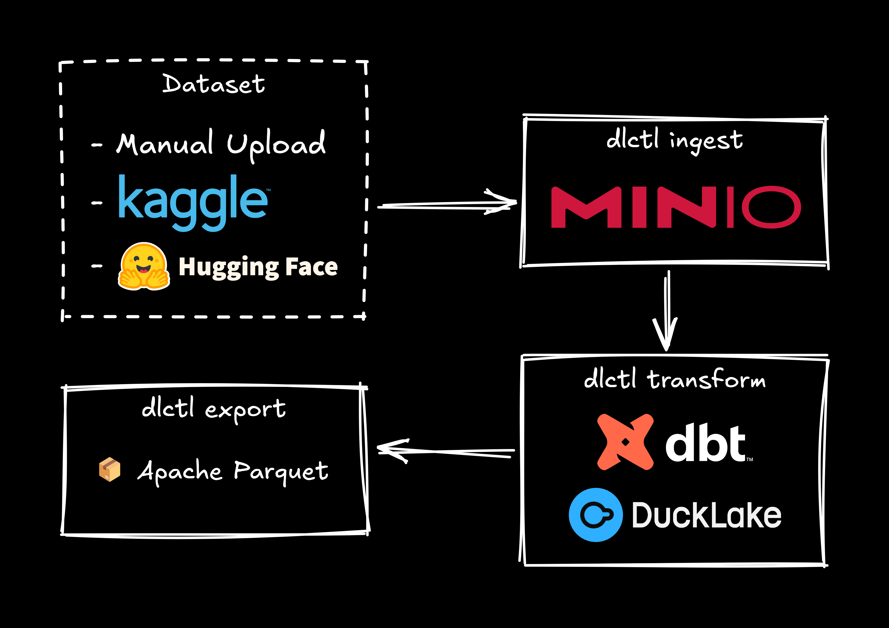

# 🧪 Data Lab

Tooling for a minimalist data lab running on top of DuckLake.

## 📋 Requirements

Minimum requirements:

- [uv](https://docs.astral.sh/uv/getting-started/installation/) with [Python 3.13](https://docs.astral.sh/uv/guides/install-python/#installing-a-specific-version) installed.
- Access to [MinIO](https://min.io/) or [S3](https://aws.amazon.com/s3/)-compatible object storage.

> [!TIP]
> I keep a MinIO instance on my tiny home lab, made of an old laptop running Proxmox, but you can easily spin up a MinIO instance using the `minio` service using the `dev` profile under `infra/services/docker/compose.yml`, after setting up your `.env` (see below).

To run your own infrastructure, you'll also need:

- [Proxmox VE 9.x](https://proxmox.com/en/products/proxmox-virtual-environment/get-started)
- [Terraform 1.13.x](https://developer.hashicorp.com/terraform/install) (see [tfswitch](https://tfswitch.warrensbox.com/Installation/))
- [Docker 28.4.x](https://docs.docker.com/engine/install/)

> [!TIP]
> Most workflows are saved as [just](https://just.systems/man/en/) commands, which are available after you install `uv` dependencies and load the virtual environment. Run `just -l` to list all available commands (more details below).

> [!NOTE]
> *The following is no longer required, and will be updated and tested soon:*
>
> We rely on the official [duckdb/dbt-duckdb](https://github.com/duckdb/dbt-duckdb) adapter to connect to DuckLake. At this time, the latest stable version of the adapter does not support attaching the external DuckLake catalog with the `DATA_PATH` option and S3 credentials, but there is [PR #564](https://github.com/duckdb/dbt-duckdb/issues/564) that solves this, so we're using what is, at this point, unreleased code (see the [dbt-duckdb](pyproject.toml#L16) dependency and the corresponding entry under [[tools.uv.sources]](pyproject.toml#L37) in the [pyproject.toml](pyproject.toml) file).

## 🚀 Quick Start

First create your own `.env` file from the provided example:

```bash
cp .env.example .env
```

Make sure you fill-in the S3 configuration for:

```bash
S3_ACCESS_KEY_ID=minio_username
S3_SECRET_ACCESS_KEY=minio_password
```

You can then activate `just` and `dlctl` via:

```bash
uv sync
source .venv/bin/activate
```

You can then setup the MinIO service as follows (it will use your env vars):

```bash
docker compose -p datalab -f infra/services/docker/compose.yml \
    --profile dev up minio minio-init -d
```

Or you can spin up the whole infrastructure locally, after Docker is running, by using:

```bash
just infra-provision-local
```

> [!TIP]
> If you're you're having trouble connecting to MinIO, make sure you're using the correct zone, which you set via the `S3_REGION` variable in `.env`.

You should also generate the `init.sql` file, so you can easily connect to your DuckLake from the CLI as well:

```bash
dlctl tools generate-init-sql
duckdb -init local/init.sql local/engine.duckdb
```

Or simply run the following command whenever you want to access your DuckLake, which will take care of the setup process for you:

```bash
just lakehouse
```

The general workflow you're expected to follow for data engineering is illustrated in the following diagram:



You're expected to implement your own [dbt](https://docs.getdbt.com/) models to power `dlctl transform`. We provide an example of this under `transform/models/`, based on the following Kaggle datasets:

- [andreagarritano/deezer-social-networks](https://www.kaggle.com/datasets/andreagarritano/deezer-social-networks)
- [undefinenull/million-song-dataset-spotify-lastfm](https://www.kaggle.com/datasets/undefinenull/million-song-dataset-spotify-lastfm)

A few datasets are already supported and pipeline are encoded using `just` commands (e.g., `econ-compnet-etl`, `graphrag-etl`, `mlops-etl`, which correspond to projects with their own YouTube videos).

You can learn all other details below.

## 🧩 Components

### dlctl/

This is where the `dlctl` command lives—standing for 'Data Lab Control'. This helps you run all the tasks supported by the data lab package. It is available as a script under [pyproject.toml](pyproject.toml#L31) and it can be accessed via:

```bash
uv sync
source .venv/bin/activate
dlctl ...
```

> [!NOTE]
> A few `torch` dependencies, like `torch_sparse` require `UV_FIND_LINKS` to be set when adding or removing any dependencies, but not during install, where `uv.lock` already has all the required information. We currently don't rely on this, but, if we do in the future, here's how to approach it:
>
> ```bash
> export UV_FIND_LINKS="https://data.pyg.org/whl/torch-2.7.0+cu126.html"
> uv add --no-build-isolation pyg_lib torch_scatter torch_sparse \
>   torch_cluster torch_spline_conv
> ```

### infra/

Implements a 4-layer infrastructure architecture to help you deploy a data stack on-premise using Proxmox, Terraform, and Docker.


- Layer 1 (`foundation/`) is a Terraform project that will provision MinIO on an LXC running on Proxmox.
- Layer 2 (`platform/`) is a Terraform project, with state storage on MinIO, that will provision three Docker VMs and a GitLab VM. GitLab will provide a container registry and come preconfigured with a GitLab Runner that executes on top of one of the Docker VMs.
- Layer 3 (`services/`) contains a Terraform project (`gitlab/`) to optionally initialize CI/CD variables/secrets from the local `.env`, and a Docker Compose project (`docker/`) to provision the data stack services.
- Layer 4 (`applications/`) contains local application deployments via Dockerized services (e.g., `ml.server`) and CI/CD integration to provision the required resources (e.g., postgres database and credentials).

### ingest/

Helps manage ingestion from difference data sources, creating the proper directory structure (see [Storage Layout](#%EF%B8%8F-storage-layout)) consisting of the retrieval for raw data and the creation proper directory structure creation. Raw data might be dropped manually, from Kaggle, Hugging Face, or some other source. This will make it easy to load it and keep it organized.

### transform/

This is the core of the data lakehouse, using [dbt](https://docs.getdbt.com/) to transform raw data into usable data, with [DuckLake](https://ducklake.select/) as the underlying catalog, running on top of SQLite.

We purposely keep this simple with SQLite, using a backup/restore strategy to/from S3, as this assumes exploratory lab work, but you can easily replace [SQLite](https://ducklake.select/docs/stable/duckdb/usage/choosing_a_catalog_database#sqlite) with a [PostgreSQL](https://ducklake.select/docs/stable/duckdb/usage/choosing_a_catalog_database#postgresql) node, if you prefer.

### export/

Gold tier datasets under your data marts are only usable externally after you export them. This component manages exports, creating them for a specific data mart catalog and schema, listing them, or purging old versions.

### graph/

Graph loading and computation on top of KùzuDB. We support operations like graph loading from S3 parquet files, and node embedding via FRP (Fast Random Projection), which is implemented using node batching with input/output from/to KùzuDB and training on top of PyTorch.

### ml/

Complete ML Engineering lifecycle implementation, including feature extraction, and model training and testing, with MLflow experiment tracking and evaluation. It also provides a REST API endpoint for inference, prediction logging, and user feedback tracking, implemented using an even-driven architecture based on Kafka topics. This optionally serves models using an A/B/n testing approach. Finally, we also implement several methods for simulating inference requests and user feedback, based on a monitoring dataset, that we use to compute monitoring metrics over time, like prediction drift, feature drift, estimated performance, or user evaluation.

### shared/

Includes the following modules:

- `settings` – loads and provides access to environment variables and other relevant constants;
- `storage` – handles mid-level S3 storage operations, like creating a dated directory structure, uploading and downloading files and directories, or managing the manifest files;
- `cache` – provides utilities to manage filesystem-based caching based on a user data directory (usually `~/.cache/datalab`);
- `lakehouse` – connects the DuckDB engine and helps with tasks like exporting datasets, or loading the latest snapshot for an export;
- `templates` – contains helper functions and `string.Template` instances to produce files like `init.sql`;
- `color` – palette and color processing utilities, mostly used to support plotting;
- `logging` – interceptor logger to replace inconsistent logging utilities (e.g., from `uvicorn`).
- `tools` – provides a function per CLI tool (callable via `dlctl tools`), for example to generate the `init.sql` file described in the `templates` module;
- `utils` – provides a `@timed` annotator to print run time, and function name sanitization code.

### notebooks/

Jupyter notebook for prototyping or standalone analyzes. Notebooks are dropped directly on the root path, since all data is loaded and saved to the DuckLake instance.

### scripts/

Individual Bash or Python scripts for generic tasks (e.g., launching KùzuDB Explorer).

### local/

Untracked directory where all your local files will live. This includes the engine database (DuckDB) and the DuckLake catalogs (e.g., `stage.sqlite`, `marts/graphs.sqlite`), which you can restore from a [backup](#backup), or create from scratch. KùzuDB databases will also live here, under `graphs/`, as well as the `init.sql` script for CLI access to the lakehouse.


## 🗃️ Storage Layout

All data is stored in a single S3 bucket (e.g., `s3://lakehouse`, tested with MinIO), with directory structure:

```
s3://lakehouse/
├── backups/
│   └── catalog/
│       ├── YYYY_MM_DD/
│       │   └── HH_mm_SS_sss/
│       │       └── lakehouse.dump
│       └── manifest.json
├── raw/
│   └── <dataset-name>/
│       ├── YYYY_MM_DD/
│       │   └── HH_mm_SS_sss/
│       │       ├── *.csv
│       │       ├── *.json
│       │       └── *.parquet
│       └── manifest.json
├── stage/
│   └── ducklake-*.parquet
├── marts/
│   └── <domain>/
│           └── ducklake-*.parquet
└── exports/
    └── <domain>/
        └── <dataset-name>/
            ├── YYYY_MM_DD/
            │   └── HH_mm_SS_sss/
            │       ├── *.csv
            │       ├── *.json
            │       └── *.parquet
            └── manifest.json
```

> [!NOTE]
> Date/time entries should be always UTC.

## ⚙️ Configuration

Configuration for data lab is all done through the environment variables defined in `.env`.

This will also support the generation of an `init.sql` file, which contains the DuckLake configurations, including the MinIO/S3 secret and all attached catalogs.

### Environment Variables

#### S3 Configurations

```bash
S3_ENDPOINT=localhost:9000
S3_USE_SSL=false
S3_URL_STYLE=path
S3_ACCESS_KEY_ID=minio_username
S3_SECRET_ACCESS_KEY=minio_password
S3_REGION=eu-west-1
```

`S3_ENDPOINT` and `S3_URL_STYLE` are only required if you're using a non-AWS object store like MinIO.

`S3_REGION` must match MinIO's region (explicitly setting one in MinIO is recommended).

#### PostgreSQL

```bash
PSQL_ROOT_PASSWORD=datalabtech
```

Set this to the `root` user password of your PostgreSQL database—only used when deploying your on-premise infrastructure, so that databases and credentials can be provisioned at a later stage. Otherwise not accessed.

#### Data Lab Specifics

```bash
S3_BUCKET=lakehouse
S3_INGEST_PREFIX=raw
S3_STAGE_PREFIX=stage
S3_SECURE_STAGE_PREFIX=secure-stage
S3_GRAPHS_MART_PREFIX=marts/graphs
S3_ANALYTICS_MART_PREFIX=marts/analytics
S3_EXPORTS_PREFIX=exports
S3_BACKUPS_PREFIX=backups
```

You can use the defaults here. Everything will live under the `S3_BUCKET`. Each stage has its own prefix under that bucket, but the mart prefixes are special—any environment variable that ends with `*_MART_PREFIX` will be associated with its down `*_MART_DB`, as show in the next section.

#### DuckLake Configurations

```bash
ENGINE_DB=engine.duckdb
STAGE_DB=stage.sqlite
SECURE_STAGE_DB=secure_stage.sqlite
GRAPHS_MART_DB=marts/graphs.sqlite
ANALYTICS_MART_DB=marts/analytics.sqlite
```

These files will live under `local/`. The DuckDB `ENGINE_DB` will be leveraged for querying. All data is tracked on the `STAGE_DB` and `*_MART_DB` catalog databases and stored on the corresponding object storage locations, as shown in the previous section. You can also used `SECURE_STAGE_DB` if you need to encrypt your data (e.g., for sensitive user data).

#### Kuzu Configurations

```bash
MUSIC_TASTE_GRAPH_DB=graphs/music_taste.kuzu
ECON_COMP_GRAPH_DB=graphs/econ_comp.kuzu
```

The data lab also leverages [Kuzu](https://kuzudb.com/) for graph data science tasks. The path for each graph database can be set here as `*_GRAPH_DB`.

#### Ollama Configurations

```bash
OLLAMA_MODELS=gemma3:latest,phi4:latest
```

Here you can preconfigure the Ollama models you want to download when running your local or on-premise infrastructure, as comma-separated `model:version` entries.

#### MLflow Configurations

```bash
MLFLOW_TRACKING_URI=http://docker-shared:5000
MLFLOW_TRACKING_USERNAME=datalabtech
S3_MLFLOW_BUCKET=mlflow
S3_MLFLOW_ARTIFACTS_PREFIX=artifacts
```

The `MLFLOW_TRACKING_*` variables configure how you interact with the MLflow server, while the `S3_MLFLOW_*` variables configure the S3 bucket where artifacts (e.g., serialized models) will be dropped into.

#### Kafka Configurations

```bash
KAFKA_BROKER_ENDPOINT=docker-shared:9092
KAFKA_GROUP_TOPIC_LIST=ml_inference_results:lakehouse-inference-result-consumer,ml_inference_feedback:lakehouse-inference-feedback-consumer
```

You can configure your Kafka endpoint here, as well as any required topics. We initialize each topic via comma-separated list of `topic:group`, so that consumers can be initialized and no warning is printed when first connecting to a topic from that consumer—this is likely overkill, but it feels cleaner.

### Generating init.sql

You can generate an `init.sql` once you setup your `.env`, so you can access your DuckLake from the CLI using `duckdb`:

```bash
dlctl tools generate-init-sql
duckdb -init local/init.sql local/engine.duckdb
```

## 📖 Usage

### Ingestion

As a rule of thumb, ingestion will be done via the `dlctl ingest` command. If a version for the current date already exists, it will output an error and do nothing—just wait a millisecond.

#### Manual

For manually uploaded datasets, you can create a directory in S3 by giving it the dataset name:

```bash
dlctl ingest dataset --manual "Your Dataset Name"
```

This will create a directory like `s3://lakehouse/raw/your_dataset_name/2025_06_03/19_56_03_000`, update `s3://lakehouse/raw/your_dataset_name/manifest.json` to point to it, and print the path to stdout.

#### From Kaggle or Hugging Face

```bash
dlctl ingest dataset \
    "https://www.kaggle.com/datasets/<username>/<dataset>"

dlctl ingest dataset \
    "https://huggingface.co/datasets/<username>/<dataset>"
```

The dataset name will be automatically extracted from the `<dataset>` slug and transformed into snake case for storage. Then, a directory like `s3://lakehouse/raw/your_dataset_name/2025_06_03/19_56_03_000` will be created, `s3://lakehouse/raw/your_dataset_name/manifest.json` updated to point to it, and the final path printed to stdout.

#### Listing Ingested Datasets

You can also list existing dataset paths for the most recent version, to be used for transformation:

```bash
dlctl ingest ls
```

Or all of them:

```bash
dlctl ingest ls -a
```

#### Pruning Empty Datasets

Sometimes you'll manually create a dataset and never upload data into the directory, or an ingestion process from a URL will fail and leave an empty directory behind. You can prune those directories using:

```bash
dlctl ingest prune
```

### Transformation

Transformations can be done via `dlctl transform`, which will call `dbt` with the appropriate arguments:

```bash
dlctl transform "<dataset-name>"
```

You can also run data tests using:

```bash
dlctl test
dlctl test -m test_type:singular
```

Or generate or serve dbt documentation using:

```bash
dlctl docs generate
dlctl docs serve
```

### Export

#### Exporting to Parquet

In order to externally use a dataset from the Lakehouse, you first need to export it. This can be done for any data mart catalog, over a selected schema. Exported datasets will be kept in dated directories with their own `manifest.json`.

```bash
dlctl export dataset "<data-mart-catalog>" "<schema>"
```

#### Listing Exported Datasets

You can list the most recent versions of exported datasets:

```bash
dlctl export ls
```

Or all of them:

```bash
dlctl export ls -a
```

#### Pruning Empty Datasets

After a few exports, you might want to remove old versions to claim space. You can prune those directories using:

```bash
dlctl export prune
```

### Backup

Since we rely on embedded databases and S3 object storage, we need to backup our databases.

> [!IMPORTANT]
> Data Lab was designed to be used in an education or research environment, so it currently doesn't support concurrent users. This could easily be added, though, as DuckLake supports PostgreSQL catalogs in place of SQLite, which we are using here.

#### Create

You can create a backup by running:

```bash
dlctl backup create
```

#### Restore

In order to restore a backup, just run:

```bash
dlctl backup restore --source "<YYYY-mm-ddTHH:MM:SS.sss>"
```

Omitting `--source` will restore the latest backup.

> [!CAUTION]
> Omitting `--target` will restore to `local/` by default, so take care not to overwrite your working version by mistake!

#### List

You can list all backups using:

```bash
dlctl backup ls
```

And you can list all files in all backups using:

```bash
dlctl backup ls -a
```

### Graph

#### Load

This will load nodes and edges into a KùzuDB database stored under `local/graphs/<schema>`, where `schema` is a schema containing nodes and edges under the `graphs` data mart catalog. Table names for nodes or edges are usually prefixed with `<dataset>_nodes_` or `<dataset>_edges_`, respectively, and should follow the format described on KùzuDB's docs.

```bash
dlctl graph load "<schema>"
```

#### Compute

A collection of graph computation calls will live here. These can be wrappers to native KùzuDB computations, or external computations. Currently, we just include the `embeddings` computation, which runs in Python using PyTorch. This will compute FRP embeddings with dimension 256, over batches of 9216 nodes, trained using 5 epochs, for the `<schema>` graph:

```bash
dlctl graph compute embeddings "<schema>" -d 256 -b 9216 -e 5
```

### ML

#### Train

Train and evaluate a model using the `dataset` table under the provided `<schema>`, while tracking the experiment using MLflow:

```bash
dlctl ml train <schema> --method logreg --features embeddings
```

The `--method` can be one of the supported algorithms (e.g., `logreg` or `xgboost`), and `--features` follows a similar approach for supported features (e.g., `tfidf` or `embeddings`). Currently only text-based datasets are supported, but the schema and training code has been generalized to support tabular data as well.

#### Server

A REST API endpoint can be run to provide an inference service with optional A/B/n testing and event-based logging, or to receive user feedback on the predictions:

```bash
dlctl ml server
dlctl ml server -h 0.0.0.0 -p 8000
```

#### Simulate

In order to help us implement and test monitoring statistics, we implemented a request simulation framework, where feedback is provided based on a monitoring dataset, which is completely separate from the dataset using for training, validation and testing. For example, to use a 1% sample of the `monitor` table from `<schema>` for A/B testing with the `dd_xgboost_embeddings` and `dd_logreg_tfidf` latest models, we can use:

```bash
dlctl ml simulate <schema> \
    --sample-fraction 0.01 \
    --model-uri "models:/dd_xgboost_embeddings/latest" \
    --model-uri "models:/dd_logreg_tfidf/latest"
```

The `models:/` URIs correspond to models trained and logged within MLflow. For production, we usually replace `latest` with a particular tag that we assign to our production models (e.g., a version).

There are several other options to help you control the simulation as well, which you can check under:

```bash
dlctl ml simulate --help
```

These include the number of passes, the batch size, the decision threshold, and several ranges to help control the fraction of feedback to provide, the fraction of wrong feedback, or the date range to simulate.

#### Monitor

This will let you compute and plot monitor statistics over time for a specific `<schema>`, optionally specifying a date range and a window size:

```bash
dlctl ml monitor compute <schema>
dlctl ml monitor compute <schema> \
    --since <start> \
    --until <end> \
    --window-size 7
```

For plotting, you must also specify one or several model URIs:

```bash
dlctl ml monitor plot <schema> \
    --model-uri "models:/dd_xgboost_embeddings/latest" \
    --model-uri "models:/dd_logreg_tfidf/latest"
```

This will produce several PNG plots under `local/monitor/`.

## 🧾 Just Commands

We provide several `just` commands, both for convenience and to keep track of data pipelines (e.g., ETL) for specific datasets. Below we provide an overview on these commands, excluding most secondary commands.

### Common

We provide a `check binary` command that will look for a specific binary in the path and check whether it's executable—the command will fail otherwise, causing any depending commands to fail as well. We implement specific check commands per binary, since we cannot use parameters in dependencies. For example:

```bash
just check duckdb
just check-terraform
```

We also provide a `confirm` command, to add as a dependency of critical commands (e.g., `terraform destroy`). This will display a confirmation message and require user input to continue:

```bash
just confirm
```

```
Are you sure? [y/N] n
error: Recipe `confirm` failed with exit code 1
```

### DuckLake

**Related video:** https://youtu.be/zn69Q7FiFfo?si=tiG4DT_apbR_-sVC

In order to run a REPL for the datalab's DuckLake instance, you can simply run:

```bash
just lakehouse
```

This will take care of the `init.sql` generation for you, but you might want to regenerate it later as well:

```bash
just generate-init-sql
```

### GraphRAG with Kuzu

**Related video:** https://youtu.be/m61u3mqu1qY?si=kmjmPHTY5-8M8Q81

| Command | Description |
| ------- | ----------- |
| `graphrag-etl` | Ingest [DSN](https://www.kaggle.com/datasets/andreagarritano/deezer-social-networks) and [MSDSL](https://www.kaggle.com/datasets/undefinenull/million-song-dataset-spotify-lastfm) datasets, run DuckLake transformations, export to Parquet, and load graph into Kuzu. |
| `graphrag-embeddings` | Compute node embeddings of dimension 256 using 5 epochs and batches of size 9216, and create vector index. |
| `graphrag` | Launch REPL for graph RAG. |
| `graphrag-all` | Run all of the above, in order. |

### Economic Competition Networks

**Related video:** https://youtu.be/pIwN7oe54i4?si=-nB0upswBGacklh4

| Command | Description |
| ------- | ----------- |
| `econ-compnet-ingest` | Ingest [The Atlas of Economic Complexity](https://atlas.hks.harvard.edu/data-downloads). |
| `econ-compnet-transform` | Run DuckLake transformations on the dataset, to produce a knowledge graph. |
| `econ-compnet-export` | Export the graph data to Parquet. |
| `econ-compnet-load` | Load the graph into Kuzu. |
| `econ-compnet-etl` | Run all of the above, in order. |
| `econ-compnet-scoring` | Computes the Common Out-Neighbor (CON) score for the Country-CompetesWith-Country graph projection. |
| `econ-compnet-all` | Run ETL and scoring commands. |

### MLOps: A/B Testing with MLflow, Kafka, and DuckLake

**Related video:** https://youtu.be/MGuj13NcdjE?si=i56T6updcLE-NFC3

#### Training

| Command | Description |
| ------- | ----------- |
| `mlops-ingest` | Ingest the depression dataset for [training](https://huggingface.co/datasets/ShreyaR/DepressionDetection) and [monitoring](https://huggingface.co/datasets/joangaes/depression). |
| `mlops-transform` | Run DuckLake transformations on the datasets, normalizing into a common format for the ML pipelines, including a train/test split and fixed folds on the training set for validation. |
| `mlops-etl` | Run all of the above, in order. |
| `mlops-train-logreg-tfidf` | Train a model using logistic regression and TF-IDF features. |
| `mlops-train-logreg-embeddings` | Train a model using logistic regression and text embedding features. |
| `mlops-train-logreg` | Train all logistic regression models. |
| `mlops-train-xgboost-tfidf` | Train a model using XGBoost and TF-IDF features. |
| `mlops-train-xgboost-embeddings` | Train a model using XGBoost and text embedding features. |
| `mlops-train-xgboost` | Train all XGBoost models. |
| `mlops-train` | Train all models. |
| `mlops-all` | Run ETL and training. |

#### Inference

| Command | Description |
| ------- | ----------- |
| `mlops-serve` | Run ML server listening on 0.0.0.0 and port 8000. |
| `mlops-test-inference` | Use `curl` to test the inference endpoint. |
| `mlops-test-feedback` | Use `curl` to test the feedback endpoint. |

#### Monitoring

| Command | Description |
| ------- | ----------- |
| `mlops-simulate-inference` | Run inference simulation for XGBoost with text embedding features, and logistic regression with TF-IDF features, using the monitor set to produce feedback. |
| `mlops-monitor-compute` | Compute monitoring statistics for the two models. |
| `mlops-monitor-plot` | Plot monitoring statistics for the two models. |

### Data Lab Infra

**Related videos:** https://www.youtube.com/playlist?list=PLeKtvIdgbljMyhjPgJeoXwa_7J9DTx3Fo

#### Config Checks

| Command | Description |
| ------- | ----------- |
| `infra-config-check-foundation` | Look for `terraform.tfvars` under `infra/foundation`. |
| `infra-config-check-platform` | Look for `terraform.tfvars` and `state.config` under `infra/platform`. |
| `infra-config-check-services` | Look for the `docker-shared` context, that should point to the corresponding Docker VM. |
| `infra-config-check-all` | Run all of the above, in order. |

#### Initializations

| Command | Description |
| ------- | ----------- |
| `infra-foundation-init` | Run `terraform init` for `infra/foundation`. |
| `infra-platform-init` | Run `terraform init` for `infra/platform`. |
| `infra-init` | Run all of the above, in order. |

#### Provisioning

| Command | Description |
| ------- | ----------- |
| `infra-provision-foundation` | Run `terraform apply` for `infra/foundation`. |
| `infra-provision-platform` | Run `terraform apply` for `infra/platform`. |
| `infra-provision-services` | Run `terraform apply` for `infra/services/gitlab` (required a configured `.env`), and `docker compose up` under the appropriate `docker-shared` context, using `infra/services/docker/compose.yml`. |
| `infra-provision-all` | Run all of the above, in order. |
| `infra-provision-local` | Run `docker compose up` with the `dev` profile enabled, using `infra/services/docker/compose.yml`. |

#### Destruction

| Command | Description |
| ------- | ----------- |
| `infra-destroy-foundation` | Run `terraform destroy` for `infra/foundation`. |
| `infra-destroy-platform` | Run `terraform destroy` for `infra/platform`. |
| `infra-destroy-services` | Run `docker compose down` and `terraform destroy` for `infra/services`. |
| `infra-destroy-all` | Run all of the above, in reversed order. |
| `infra-destroy-local` | Run `docker compose down` with the `dev` profile enabled for `infra/services`. |

#### Utilities

| Command | Description |
| ------- | ----------- |
| `infra-show-tf-credentials` `<layer>` | Print the credentials for a specific `layer` (`foundation` or `platform`). |
| `infra-show-credentials` | Print all credentials. |
